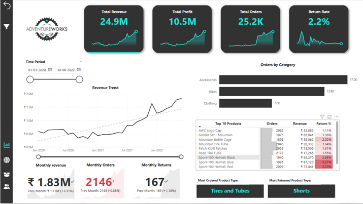

# 📊 Power BI Project: AdventureWorks KPI Analysis Dashboard
**Domain**: Retail & E-Commerce  
**Report Type**: Executive Performance Dashboard  
**Toolset**: Power BI Desktop | DAX | Power Query | Star Schema | Data Modeling | Time Intelligence


🌐 Embedded Report (Live Demo)  
🧪 Test and interact with this dashboard online   
  

🔗 [AdventureWorks KPI Analysis] -- Click the Link to access Report  
<iframe title="AdventureWorks KPI Analysis"  
  width="600" height="636"   
  src="https://app.powerbi.com/view?r=eyJrIjoiY2UxN2IzZmUtZDZkOS00MDcwLWEzMGItZmNlNTBhMWQ4MzRmIiwidCI6IjI4OTI5MmNiLTQwNTctNGY0YS1iMWIyLWRiYzU4NjY3OGViNSJ9&pageName=a397e3f0080e8cc1e13a"  
  frameborder="0" allowFullScreen="true"></iframe>


---

## 📝 Executive Summary

This dashboard provides a **360-degree view of AdventureWorks’ global sales operations**, enabling C-level executives, regional managers, and analysts to track key business metrics such as **revenue, profit, and customer trends**. The goal is to deliver **self-service analytics**, identify sales opportunities and gaps, and optimize business performance using **real-time insights**.

Built with **scalable data modeling**, intuitive design, and **high-performance DAX**, the dashboard exemplifies best practices in enterprise BI reporting.

---

## 🎯 Business Problem Statement

AdventureWorks, a global retail brand, required a centralized, interactive BI dashboard to:

- Monitor sales and profitability across countries, products, and time  
- Identify underperforming product categories or geographies  
- Enable dynamic filtering for executive presentations and strategic planning  
- Provide daily, monthly, and yearly performance trends  

---

## 🎯 Business Objectives

- Present interactive KPIs for revenue, profit, order volume, and margins  
- Enable region-wise sales and profitability tracking  
- Compare product category performance across timelines  
- Deliver drill-down capabilities for better root cause analysis  
- Forecast future performance and detect seasonal trends  

---

## 📌 Key Metrics & KPIs Tracked

| **KPI**                     | **Description**                                              |
|-----------------------------|--------------------------------------------------------------|
| Total Sales                 | Total revenue across orders and time periods                 |
| Total Profit                | Net profit after cost of goods sold                          |
| Profit Margin %             | Calculated as (Profit / Sales) * 100                         |
| Order Count                 | Number of orders by date, country, and category              |
| Sales by Country            | Regional breakdown for international sales strategy          |
| Top Product Categories      | Most profitable and popular segments                         |
| Monthly & Yearly Sales Trend| Time intelligence metrics for seasonality analysis           |

---

## 📊 Dashboard Features

- 📌 **Executive KPI View**: Cards with total sales, profit, and margin %  
- 🌍 **Map Visualization**: Country-wise performance indicators  
- 📈 **Trend Analysis**: Monthly and yearly sales trend using line charts  
- 📦 **Category Breakdown**: Sales and profit by product category  
- 📆 **Interactive Date Filters**: Slicer with YTD, QTD, MTD selections  
- 🔍 **Drill-through Pages**: Explore deeper insights by product or region  
- 🎯 **Dynamic Tooltips**: Hover-based contextual information  
- 💬 **Bookmarks**: Pre-set views for executive meetings  

---

## 🧱 Technical Architecture

### **Data Source**
- Source: AdventureWorks DW (mocked for demo)  
- Format: CSV & Excel  
- Volume: ~100K rows across Fact & Dimension tables  

### **Data Preparation**
- Done in Power Query (M Language)  
- Data cleanup: null handling, renaming, formatting  
- Merge & Append queries for unified modeling  
- Normalized into star schema:  
  `FactInternetSales`, `DimProduct`, `DimCustomer`, `DimDate`, `DimGeography`

### **Data Modeling**
- Star Schema with enforced relationships  
- Fact Table: `Sales`  
- Dimensions: `Date`, `Product`, `Geography`, `Customer`

### **DAX Measures**
```DAX
Total Sales = SUM(FactInternetSales[SalesAmount])
Total Profit = SUM(FactInternetSales[SalesAmount]) - SUM(FactInternetSales[TotalProductCost])
Profit Margin % = DIVIDE([Total Profit], [Total Sales]) * 100
Sales YTD = TOTALYTD([Total Sales], 'Date'[Date])
📈 Visualizations Used
Type	Purpose
KPI Cards	Summary metrics for executive insight
Line & Area Charts	Time-based trend analysis
Bar/Column Charts	Category comparison
Map Visuals	Geo-level revenue performance
Matrix	Multi-level dimensional data (e.g., category/month)
Drillthrough	Detailed navigation into filtered data
