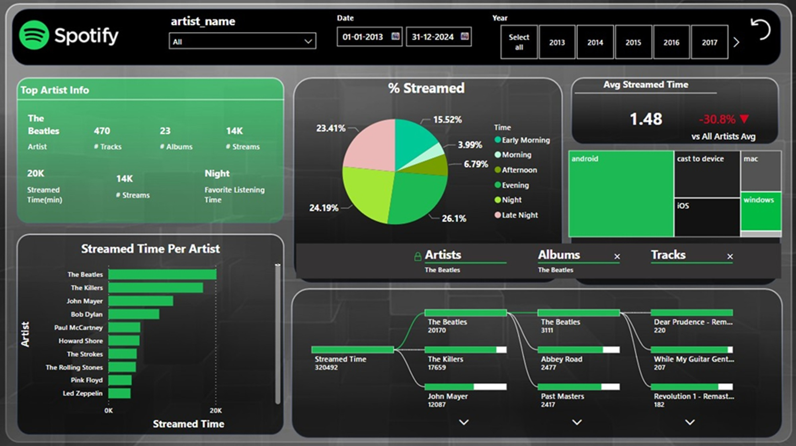

# 🎵 Spotify Music Analytics Dashboard

**Domain**: Entertainment / Music Streaming  
**Toolset**: Power BI Desktop | Power Query | DAX | Time Intelligence | Audio Feature Modeling  
**Report Type**: Music Insights & Trend Analysis Dashboard

[]
**[Click to View Live Report](https://app.powerbi.com/view?r=eyJrIjoiMWNmM2MyMGMtYTEzMy00NmEwLWIxZWYtNTllNmZjNDQ3YzkzIiwidCI6IjI4OTI5MmNiLTQwNTctNGY0YS1iMWIyLWRiYzU4NjY3OGViNSJ9)**
<iframe title="spotify_reporting" width="600" height="486" src="https://app.powerbi.com/view?r=eyJrIjoiMWNmM2MyMGMtYTEzMy00NmEwLWIxZWYtNTllNmZjNDQ3YzkzIiwidCI6IjI4OTI5MmNiLTQwNTctNGY0YS1iMWIyLWRiYzU4NjY3OGViNSJ9" frameborder="0" allowFullScreen="true"></iframe>

---

## 📘 Executive Summary

The **Spotify Music Analytics Dashboard** provides interactive, feature-rich insights into song performance, artist popularity, and audio feature trends. Built using Power BI, the report is a comprehensive tool for understanding how music evolves across time, genres, and listener preferences. 

Whether you're a label manager, producer, or a data enthusiast, this dashboard delivers a 360° view of the Spotify music landscape using audio metrics like danceability, energy, tempo, and popularity.

---

## 🔍 Key Features

- 🎧 **Top Artists & Tracks**  
  - Ranked by popularity, release year, and audio attributes.
- 🎼 **Genre-wise Audio Analysis**  
  - Compare danceability, valence, loudness, speechiness, and more across genres.
- 📊 **Year-over-Year Trends**  
  - See how music characteristics evolved across decades.
- 🧪 **Distribution Analysis**  
  - Box plots/histograms for energy, tempo, duration, and acousticness.
- 🧮 **Interactive Filters**  
  - Slice by genre, artist, year, and popularity range.

---

## 📈 KPIs & Metrics Tracked

| Metric        | Description                                             |
|---------------|---------------------------------------------------------|
| Popularity    | Spotify score based on recent streams and engagement   |
| Danceability  | Suitability of a track for dancing                     |
| Energy        | Intensity and activity level of a song                 |
| Tempo (BPM)   | Beats per minute                                       |
| Valence       | Positivity of the track                                |
| Loudness      | Average audio loudness in dB                           |
| Speechiness   | Degree of spoken word presence                         |

---

## 🧠 Key Insights

- Songs with **high energy and danceability** dominate popular charts.
- Genres like **Pop** and **EDM** are consistently high in energy and loudness.
- Audio features show clear evolution in sound from early 2000s to present.
- The number of tracks released has **increased dramatically since 2010**.
